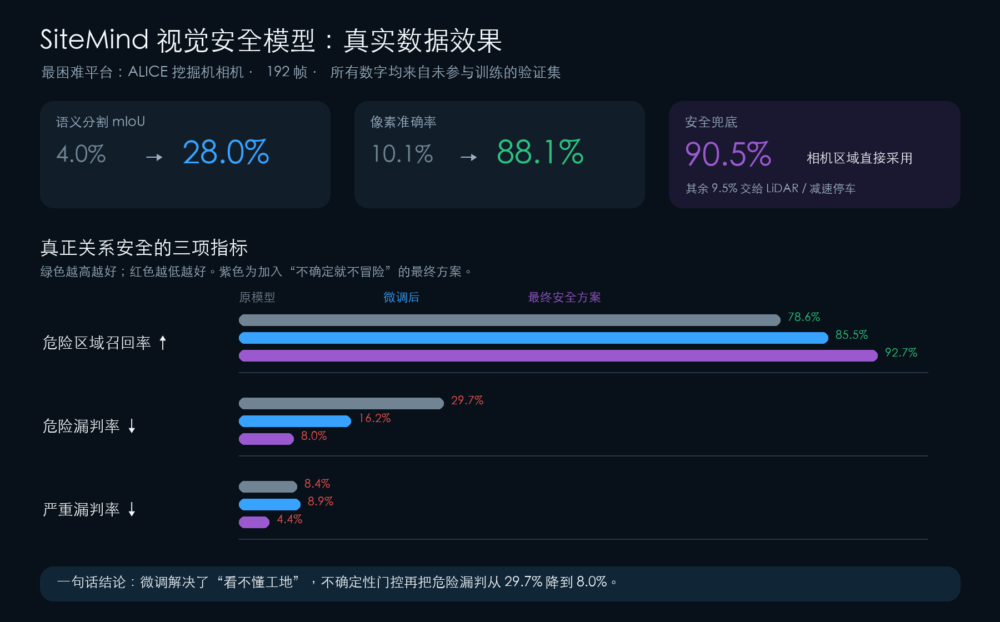
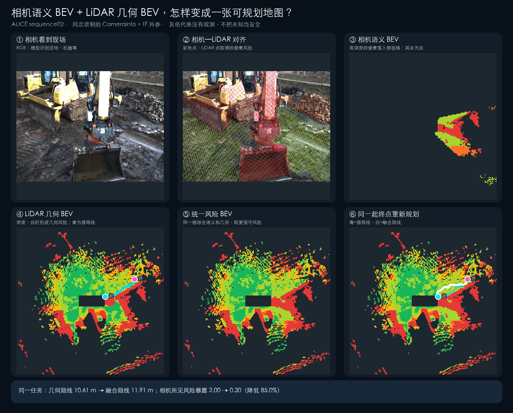
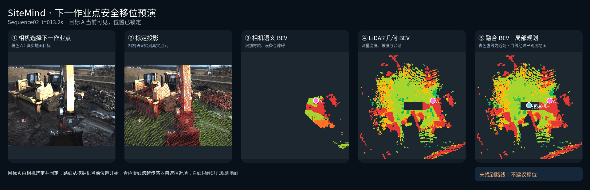

# SiteMind

Camera–LiDAR worksite intelligence and risk-aware local planning for autonomous construction machinery.

SiteMind turns camera semantics, LiDAR terrain geometry, calibration, uncertainty and short-horizon memory into a conservative bird's-eye-view (BEV) risk map. Its current end-to-end application lets an operator select a measured ground target, locks that target in world coordinates, and continuously replans a local relocation route from the excavator reference point. If the observed map has no continuous safe corridor, the system returns a stop decision instead of treating unknown space as free.

> **Scope:** this repository demonstrates offline replay on real sensor data and map-level local planning. It is not a vehicle controller, a kinematically executable trajectory planner, or a verified autonomous excavator system.

[Reproduction guide](docs/REPRODUCIBILITY.md) · [Demo guide](docs/DEMO_GUIDE.md) · [Script index](scripts/README.md)

## What is implemented

- PP-LiteSeg fine-tuning and safety-oriented evaluation on GOOSE-Ex.
- Semantic class-to-risk mapping with uncertainty-based abstention.
- LiDAR elevation, slope and step-height risk grids.
- Camera projection with calibrated intrinsics, `plumb_bob` distortion and ROS TF extrinsics.
- Occlusion-aware image sampling and semantic-to-BEV projection.
- Conservative camera-semantic and LiDAR-geometry risk fusion.
- Pose-aligned short-horizon BEV memory.
- Camera-selected ground targets, world-coordinate locking and per-frame target recovery.
- Risk-aware A* planning from the excavator reference point.
- Explicit separation of the unobserved self-filter connector from the terrain-verified route.
- Conservative stop behavior when no observed route exists.
- 41 unit and regression tests for data pairing, projection, fusion, temporal alignment and planning.

## System pipeline

```text
RGB image ──> PP-LiteSeg ──> semantic risk + uncertainty ──┐
                                                           ├─> fused temporal BEV
LiDAR ──> elevation / slope / step geometry risk ──────────┘          │
CameraInfo + TF ──> calibrated semantic projection                    │
Vehicle pose ──> aligned short-horizon memory                         │
                                                                      v
Camera-selected ground point ──> world-fixed goal ──> risk-aware A* / stop
```

## Results snapshot

The perception numbers below use the 407-frame GOOSE-Ex validation split, which was not used for training. The ALICE subset contains 192 excavator frames.

| Metric | GOOSE pretrained baseline | SiteMind fine-tuned model |
|---|---:|---:|
| Validation mIoU | 7.58% | 33.18% |
| Validation pixel accuracy | 31.00% | 86.05% |
| Validation false-safe rate | 24.62% | 11.02% |
| ALICE mIoU | 3.97% | 27.99% |
| ALICE pixel accuracy | 10.07% | 88.08% |

On the ALICE subset, entropy gating retained 90.50% of camera pixels while reaching 92.66% hazardous-region recall and reducing the false-safe rate to 7.97%. Rejected pixels are not marked free; they remain unknown or are handed to LiDAR and the stop policy.



The calibrated fusion example below uses `CameraInfo` and TF from the same ALICE Sequence02 ROS bag. It demonstrates the engineering chain, not held-out generalization: the annotated Sequence02 frames used by the visualization belong to the training split.



When the current fused map contains no continuous observed corridor, the local planner refuses to invent a path through unknown space.



## Quick start

The core library and synthetic demo do not require GOOSE-Ex, ROS or a GPU.

```bash
git clone https://github.com/Minyue0213/Sitemind.git
cd Sitemind
python3 -m venv .venv
source .venv/bin/activate
python -m pip install --upgrade pip
python -m pip install -e '.[dev]'
pytest
python scripts/run_synthetic_demo.py
```

The synthetic output is written to `artifacts/synthetic_demo.png`.

For ROS bag extraction:

```bash
python -m pip install -e '.[dev,ros]'
```

PP-LiteSeg training and inference use the separate CUDA/SuperGradients environment described in [`requirements-autodl.txt`](requirements-autodl.txt). Large model files and datasets are excluded from Git; the SiteMind fine-tuned checkpoints are distributed through GitHub Releases.

## Repository layout

```text
configs/                  Risk and geometry parameters
docs/                     Architecture, scope and reproduction notes
scripts/                  Training, extraction, fusion, evaluation and rendering CLIs
src/sitemind/data/        Strict GOOSE / GOOSE-Ex readers and frame pairing
src/sitemind/evaluation/  Segmentation, calibration and safety metrics
src/sitemind/geometry/    LiDAR elevation and terrain-risk layers
src/sitemind/fusion/      Projection, conservative fusion and temporal alignment
src/sitemind/planning/    Risk-aware A* and camera-selected worksite goals
tests/                    Unit and regression tests
```

## Data and weights

Datasets and raw ROS bags are not redistributed. Two SiteMind fine-tuned PP-LiteSeg checkpoints are available from the [`v0.1.0` release](https://github.com/Minyue0213/Sitemind/releases/tag/v0.1.0):

| Checkpoint | Selection criterion | Recommended use | SHA-256 |
|---|---|---|---|
| [`best_safety.pth`](https://github.com/Minyue0213/Sitemind/releases/download/v0.1.0/best_safety.pth) | Best validation safety score, epoch 11 | Default for conservative risk mapping and planning | `dbd5c83af8120136051f120ed7c114885b6c346ecdbe69ce2b05e83ea2f51430` |
| [`best_miou.pth`](https://github.com/Minyue0213/Sitemind/releases/download/v0.1.0/best_miou.pth) | Best validation mIoU, epoch 13 | Semantic-segmentation comparison | `7cbee2d7019170ea549a0b78072f8cb9ab97c6732af007e2e90e150a050d2b2c` |

Download the recommended checkpoint:

```bash
mkdir -p models
curl -L https://github.com/Minyue0213/Sitemind/releases/download/v0.1.0/best_safety.pth \
  -o models/best_safety.pth
```

These are full training checkpoints and include the model, optimizer, scheduler and mixed-precision states. They use the 64-class GOOSE ontology and a `512 × 512` input resolution. See the [reproduction guide](docs/REPRODUCIBILITY.md) for inference and evaluation commands.

- [GOOSE / GOOSE-Ex homepage](https://goose-dataset.de/)
- [Dataset setup and downloads](https://goose-dataset.de/docs/setup/)
- [ALICE excavator platform](https://goose-dataset.de/docs/alice/)
- [GOOSE-Ex paper](https://goose-dataset.de/images/gooseEx.pdf)

GOOSE data is published under **CC BY-SA 4.0**. Follow its official terms and citation guidance. The released fine-tuned checkpoints are provided under **CC BY-SA 4.0** with attribution to GOOSE / GOOSE-Ex and PP-LiteSeg. The MIT license in this repository applies only to the SiteMind source code and original documentation, not to third-party data or assets.

## Important limitations

- Risk values and terrain thresholds are prototype engineering parameters, not soil-bearing-capacity or rollover guarantees.
- The current planner operates on a 2D risk grid and does not fully model track width, chassis yaw, minimum turning radius, dynamics or trajectory tracking.
- The near-vehicle self-filter region is unobserved. Its connector is visualized separately from the terrain-verified route.
- Full 2D and 3D validation are evaluated separately because the compact validation packages do not include the per-recording camera–LiDAR extrinsics required for pixel-level fusion.
- Real pixel-level fusion is demonstrated on an ALICE raw sequence with complete calibration; broader multi-sequence fusion evaluation remains future work.

## License

SiteMind source code is released under the [MIT License](LICENSE).

## Acknowledgements

This project builds on the GOOSE / GOOSE-Ex datasets and the PP-LiteSeg architecture. Please cite the original dataset and model papers when using the corresponding data, weights or methods.
